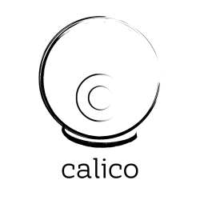

# calico

[](calico.png)

*Camera Lite Composer*, or just the project behind my blog series [SObjectizer Tales](https://marcoarena.wordpress.com/sobjectizer-tales/).

`calico` is a (toy) C++ program that takes frames from your default video device (e.g. your webcam) and processes them asynchronously through a pipeline of components (*agents*) that can be combined as you like. `calico` is based on  [SObjectizer](https://github.com/stiffstream/sobjectizer), a library for developing concurrent applications through the power of *message passing* and *actor model*. Throughout the blog series, you will be exposed to some problems of this domain and you will learn how to use SObjectizer to deal with them.

## How to use this repository

You don't need to copy and paste code from the blog. Clone this repository instead.

Too late joining the party? The series went forward?

**No worries!**

Every new post published in the series comes with a [tag](https://github.com/ilpropheta/calico/tags) in this repository that corresponds to the number of the episode. Thus, switching to tag `1` will get you back to when the series started. Second episode? No problem, switch to tag `2`, and so on...

## Build and usage

`calico` requires `C++20` and provides `CMake` files to generate your preferred system's build files. However, it assumes a few dependencies are available on the system:

- [sobjectizer](https://github.com/stiffstream/sobjectizer)
- [opencv](https://github.com/opencv/opencv)
- [gtest](https://github.com/google/googletest)
- [grpc](https://github.com/grpc/grpc)

To build and install these libraries, `vcpkg` is an option that works on several platforms (just bear in mind that, at the time of writing, the`opencv` build is broken on Linux - one alternative is installing from the system package manager - e.g. `apt-get install libopencv-dev`).

Also, I describe here below how to build the project on **Windows + Visual Studio** and on **docker**.

### Windows + Visual Studio

In this scenario, following these steps is an easy way to build and run the project:

How to build and run `calico` on Windows using Visual Studio (tested on `Visual Studio 2022`):

1. Install [vcpkg](https://vcpkg.io/) (if something goes wrong with the latest version, this tag `2023.08.09` has been tested successfully).
2. Add `VCPKG_ROOT` to your environment variables, pointing to `vcpkg`'s root folder (e.g. `c:\vcpkg`).
3. Install the required dependencies from the command line:

```
vcpkg install sobjectizer --triplet x64-windows
vcpkg install opencv --triplet x64-windows
```
(if your system is different, change the triplet accordingly)

4. Clone `calico` and just [open it](https://learn.microsoft.com/en-us/cpp/build/open-folder-projects-cpp?view=msvc-170) on Visual Studio.
5. Build and run the project (if `VCPKG_ROOT` is set correctly, `CMake` will find the libraries installed by `vcpkg` through  `CMAKE_TOOLCHAIN_FILE` that is set in `CMakePresets.json`, provided by the project).

Note that `vcpkg` is not strictly required but it's just a simple way to obtain, build and make available the required dependencies. Also, the step 2 is not really needed if you [integrate `vcpkg` user-wide](https://learn.microsoft.com/en-us/vcpkg/commands/integrate).

If you are wondering why `calico` does not use [vcpkg manifest](https://learn.microsoft.com/en-us/vcpkg/users/manifests), it's because manifest ignores system-available libraries, causing them to be rebuilt. For example, if you have already installed `opencv` globally (e.g. `%VCPKG_ROOT%\installed\x64-windows`), when building the project for the first time, `opencv` would be rebuilt in any case. Since `calico` is not a real project, I just want to keep things simple and quick.

### Docker

If you use `docker`, I pushed a [calico-builder](https://hub.docker.com/repository/docker/ilpropheta/calico-builder/) image to the registry that can be used to build `calico` more easily with `gcc` under Linux (Debian). The image contains all the tools (`gcc`, `cmake`, `ninja`, `vcpkg`, etc) and project dependencies. It's based on the `gcc` [official docker image](https://hub.docker.com/_/gcc). Internally, it uses `vcpkg` to gather and build dependencies.

`calico-builder` provides also the support for reaching the container via SSH (e.g. from Visual Studio).

If you want to rebuild the image yourself, the `Dockerfile` is here in the repository.

The image is huge because it contains `grpc` that is used from episode `12`.

Note that the webcam is not available from inside the container without some particular tweaks. Then you can simply use the `virtual_device` described in the series and also check if the images are flowing through agents like `image_tracer`, described in the series too.

#### Build from the terminal

To build from the terminal, run the container mapping the source code to a volume:

```
docker run --rm -v <Path-to-your-local-folder>:/usr/src/calico -it calico_builder /bin/bash
```

For example, assuming I am on Windows:

```
docker run --rm -v C:\source\calico:/usr/src/calico -it ilpropheta/calico-builder /bin/bash
```

Then, from the newly-created container, just use `CMake` to build the project, using `CMAKE_TOOLCHAIN_FILE` since `vcpkg` is available in the container:

```
cd /usr/src/calico/
cmake -S . -B build -G Ninja -DCMAKE_BUILD_TYPE=Release -DCMAKE_TOOLCHAIN_FILE=/opt/vcpkg/scripts/buildsystems/vcpkg.cmake
cmake --build build
```

#### Build from Visual Studio

You can let Visual Studio connect to the running container via SSH. In this case, running the container is slightly different:

```
docker run --rm -it -p 5000:22 ilpropheta/calico-builder
```

From Visual Studio, be sure you set up a valid connection with these settings:

- Host name: `localhost`
- Port: `5000`
- User name: `marco`
- Authentication type: `Password`
- Password: `marco`

For your convenience, `CMakePresets.json` provides two target systems you can use in this scenario (which automatically map `CMAKE_TOOLCHAIN_FILE` properly):

- `docker-debug`
- `docker-release`

At this point, you can just build the project from Visual Studio as usual.

#### Rebuild the docker image

Feel free to make any changes to the Dockerfile and rebuild it on your machine.

Here is an example for building the docker image from `calico`'s root folder:

```
docker build --tag calico_builder .
```

## The truth behind the name of this repository

Well, the acronym makes some sense, doesn't it? After all, this program enables you to compose image "processors" on top of the camera stream.

However, sometimes I have this tendency to name projects after something related to piracy, as it happened [here](https://github.com/ilpropheta/bonnet) and [here](https://github.com/ilpropheta/bellamy)...